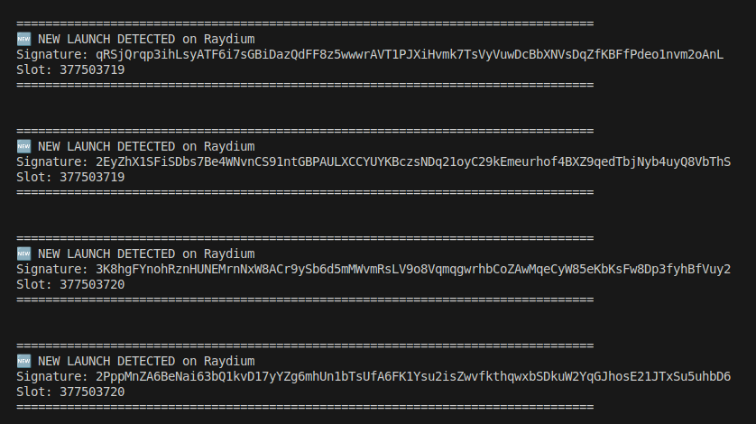

### Token Launch Monitor

A Solana program to monitor and analyze token launches in real-time, providing insights into token safety and potential risks.

This program monitors token launches on Raydium and also fetches information from Raydium Launchpad.

